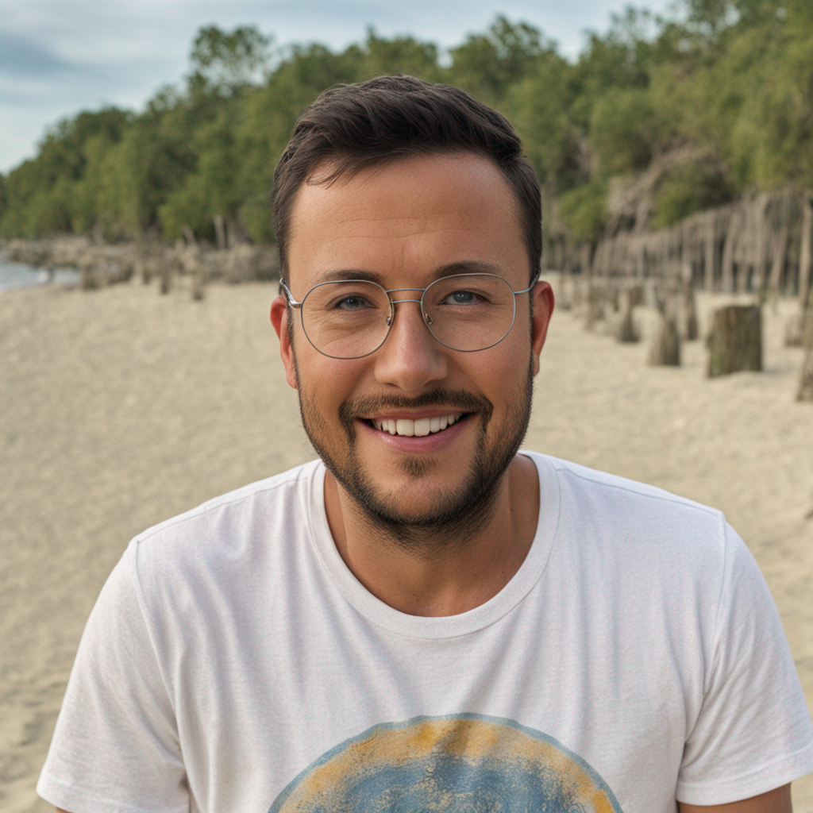

# Dreambooth
 Implementation of Dreambooth to generate your photorealistic images
<p float="left">
  
  
</p>

## Installation
It makes use of the Auotrain-advanced package from hugging face: https://github.com/huggingface/autotrain-advanced. Please note you will need python >= 3.8 for AutoTrain Advanced to work properly.
```
pip install autotrain-advanced
```
## How to run
Make a folder called 'images' after cloning the repo in the repository. Add 5-6 images that you want to fine-tune the model.

